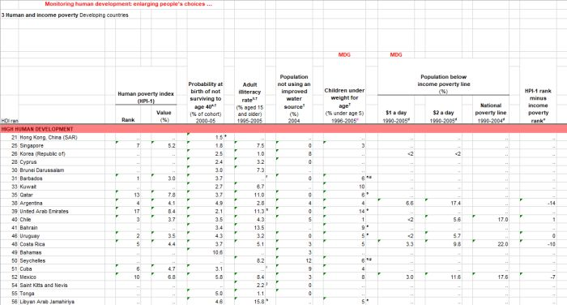

# whyqd: simplicity, transparency, speed

[](docs/en/latest/?badge=latest)
[](https://github.com/whythawk/whyqd/actions)
[](https://zenodo.org/badge/latestdoi/239159569)

## What is it?

> More research, less wrangling

[**whyqd**](https://whyqd.com) (/wɪkɪd/) is a curatorial toolkit intended to produce well-structured and predictable 
data for research analysis.

It provides an intuitive method for creating schema-to-schema crosswalks for restructuring messy data to conform to a 
standardised metadata schema. It supports rapid and continuous transformation of messy data using a simple series of 
steps. Once complete, you can import wrangled data into more complex analytical or database systems.

**whyqd** plays well with your existing Python-based data-analytical tools. It uses [Ray](https://www.ray.io/) and 
[Modin](https://modin.readthedocs.io/) as a drop-in replacement for [Pandas](https://pandas.pydata.org/) to support 
processing of large datasets, and [Pydantic](https://pydantic-docs.helpmanual.io/) for data models. 

Each definition is saved as [JSON Schema-compliant](https://json-schema.org/) file. This permits others to read and 
scrutinise your approach, validate your methodology, or even use your crosswalks to import and transform data in 
production.

Once complete, a transform file can be shared, along with your input data, and anyone can import and validate your 
crosswalk to verify that your output data is the product of these inputs.

## Why use it?

**whyqd** allows you to get to work without requiring you to achieve buy-in from anyone or change your existing code.

If you don't want to spend days or weeks slogging through data when all you want to do is test whether your source 
data are even useful. If you already have a workflow and established software which includes Python and pandas, and 
don't want to change your code every time your source data changes.

If you want to go from a [Cthulhu dataset](https://whyqd.readthedocs.io/en/latest/tutorials/tutorial3) like this:


*UNDP Human Development Index 2007-2008: a beautiful example of messy data.*

To this:

|    | country_name           | indicator_name   | reference   |   year |   values |
|:---|:-----------------------|:-----------------|:------------|:-------|:---------|
|  0 | Hong Kong, China (SAR) | HDI rank         | e           |   2008 |       21 |
|  1 | Singapore              | HDI rank         | nan         |   2008 |       25 |
|  2 | Korea (Republic of)    | HDI rank         | nan         |   2008 |       26 |
|  3 | Cyprus                 | HDI rank         | nan         |   2008 |       28 |
|  4 | Brunei Darussalam      | HDI rank         | nan         |   2008 |       30 |
|  5 | Barbados               | HDI rank         | e,g,f       |   2008 |       31 |

With a readable set of scripts to ensure that your process can be audited and repeated:

```python
schema_scripts = [
    f"UNITE > 'reference' < {REFERENCE_COLUMNS}",
    "RENAME > 'country_name' < ['Country']",
    "PIVOT_LONGER > ['indicator_name', 'values'] < ['HDI rank', 'HDI Category', 'Human poverty index (HPI-1) - Rank;;2008', 'Human poverty index (HPI-1) - Value (%);;2008', 'Probability at birth of not surviving to age 40 (% of cohort);;2000-05', 'Adult illiteracy rate (% aged 15 and older);;1995-2005', 'Population not using an improved water source (%);;2004', 'Children under weight for age (% under age 5);;1996-2005', 'Population below income poverty line (%) - $1 a day;;1990-2005', 'Population below income poverty line (%) - $2 a day;;1990-2005', 'Population below income poverty line (%) - National poverty line;;1990-2004', 'HPI-1 rank minus income poverty rank;;2008']",
    "SEPARATE > ['indicator_name', 'year'] < ';;'::['indicator_name']",
    "DEBLANK",
    "DEDUPE",
]
```

Then **whyqd** may be for you.

## How does it work?

> Crosswalks are mappings of the relationships between fields defined in different metadata 
> [schemas](https://whyqd.readthedocs.io/en/latest/strategies/schema). Ideally, these are one-to-one, where a field in 
> one has an exact match in the other. In practice, it's more complicated than that.

Your workflow is:

1. Define a single destination schema,
2. Derive a source schema from a data source,
3. Review your source data structure,
4. Develop a crosswalk to define the relationship between source and destination,
5. Transform and validate your outputs,
6. Share your output data, transform definitions, and a citation.

It starts like this:

```python
import whyqd as qd
```

[Install](https://whyqd.readthedocs.io/en/latest/installation) and then read the [quickstart](https://whyqd.readthedocs.io/en/latest/quickstart).

There are four worked tutorials to guide you through typical scenarios:

- [Aligning multiple sources of local government data from a many-headed Excel spreadsheet to a single schema](https://whyqd.readthedocs.io/en/latest/tutorials/tutorial1)
- [Pivoting wide-format data into archival long-format](https://whyqd.readthedocs.io/en/latest/tutorials/tutorial2)
- [Wrangling Cthulhu data without losing your mind](https://whyqd.readthedocs.io/en/latest/tutorials/tutorial3)
- [Transforming data containing American dates, currencies as strings and misaligned columns](https://whyqd.readthedocs.io/en/latest/tutorials/tutorial4)

## Installation

You'll need at least Python 3.9, then install with your favourite package manager:

```bash
pip install whyqd
```

To derive a source schema from tabular data, import from `DATASOURCE_PATH`, define its `MIMETYPE`, and derive a schema:

```python
import whyqd as qd

datasource = qd.DataSourceDefinition()
datasource.derive_model(source=DATASOURCE_PATH, mimetype=MIMETYPE)
schema_source = qd.SchemaDefinition()
schema_source.derive_model(data=datasource.get)
schema_source.fields.set_categories(name=CATEGORY_FIELD, 
                                    terms=datasource.get_data())
schema_source.save()
```

[Get started...](https://whyqd.readthedocs.io/en/latest/quickstart)

## Changelog

The version history can be found in the [changelog](https://whyqd.readthedocs.io/en/latest/changelog).

## Background and funding

**whyqd** was created to serve a continuous data wrangling process, including collaboration on more complex messy 
sources, ensuring the integrity of the source data, and producing a complete audit trail from data imported to our 
database, back to source. You can see the product of that at [openLocal.uk](https://openlocal.uk).

**whyqd** [received initial funding](https://eoscfuture-grants.eu/meet-the-grantees/implementation-no-code-method-schema-schema-data-transformations-interoperability)
from the European Union's Horizon 2020 research and innovation programme under grant agreement No 101017536. Technical 
development support is from [EOSC Future](https://eoscfuture.eu/) through the 
[RDA Open Call mechanism](https://eoscfuture-grants.eu/provider/research-data-alliance), based on evaluations of 
external, independent experts.

The 'backronym' for **whyqd** /wɪkɪd/ is *Whythawk Quantitative Data*, [Whythawk](https://whythawk.com)
is an open data science and open research technical consultancy.

## Licence

The [**whyqd** Python distribution](https://github.com/whythawk/whyqd) is licensed under the terms of the 
[BSD 3-Clause license](https://github.com/whythawk/whyqd/blob/master/LICENSE). All documentation is released under 
[Attribution 4.0 International (CC BY 4.0)](https://creativecommons.org/licenses/by/4.0/). **whyqd** tradenames and 
marks are copyright [Whythawk](https://whythawk.com).
