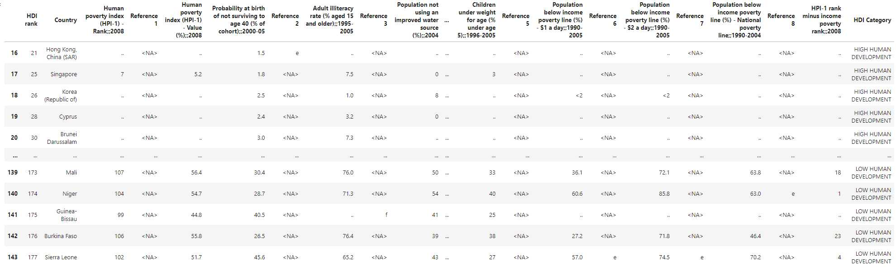

# Tutorial 3: Wrangling Cthulhu data without losing your mind

**whyqd** (/wɪkɪd/) should help you perform crosswalks on any source data. Your challenge is identifying an appropriate
strategy.

!!! abstract "Learning outcomes"
    - Develop techniques for assessing complex source data structure
    - Explain and describe reproducible crosswalks for complex data transformation
    - Perform staged pivot-based crosswalks and generate a schema-compliant output

    `SOURCE_DATA` are from [Human Development Report 2007 - 2008](https://github.com/whythawk/data-wrangling-and-validation/tree/master/data/lesson-spreadsheet).
    These data are long lost from the internet, and I maintain a repository for educational use. It is assumed you have 
    familiarity with [Python](https://www.python.org/) and [Pydantic](https://docs.pydantic.dev/).
    
    ```python
    SOURCE_DATA = "https://github.com/whythawk/whyqd/blob/d95b9a8dc917ed119f0b64cb2a3f699e4fee7a8d/tests/data/HDR-2007-2008-Table-03.xlsx"
    MIMETYPE = "xlsx"
    ```

## Background

!!! quote
    In 1990 the first [Human Development Report](http://www.hdr.undp.org/) introduced a new 
    approach for advancing human wellbeing. Human development – or the human development approach - is 
    about expanding the richness of human life, rather than simply the richness of the economy in which 
    human beings live. It is an approach that is focused on people and their opportunities and choices.

For years I've taught an introductory [Data wrangling & validation](https://github.com/whythawk/data-wrangling-and-validation)
course using the same training data-series: the *Human Development Index report of 2007 - 2008* released by the UNDP as 
part of the *Millennial Development Goals*.

The 2007-8 HDI report was listed as a series of about 50 spreadsheets, each dataset aligned with the objectives of the 
[Millennium Development Goals](https://www.un.org/millenniumgoals/). These supporting information were used to track 
countries meeting the MDG targets.

These days it's a slick affair with beautifully-prepared open data in a standardised format. Back then open data was
in its infancy, and these data were a constantly-changing mess of non-standard Excel spreadsheets.


*UNDP Human Development Index 2007-2008: a beautiful example of messy data.*

If you wanted to do any analysis on these data you first had to set about rebuilding these spreadsheets into a single 
database aligned to a common schema.

The longer you spend with it, the worse it gets. Teaching data curators in countries around the world the importance of 
open standards and well-structured machine-readable data is brought home when seeing this and experiencing how difficult 
it is to work with.

They're a great educational resource, demonstrating that even well-resourced organisations with technically astute 
staff are capable of travesties of data curation.

## Strategy

!!! tip "Strategy"
    H.P. Lovecraft, that old scifi-writing bigot, described Cthulhu as:

    > *"A monster of vaguely anthropoid outline, but with an octopus-like head whose face was a mass of feelers, a  
    > scaly, rubbery-looking body, prodigious claws on hind and fore feet, and long, narrow wings behind."*

    With a monster that big, you don't fight it all at once.

The majority of tabular data are stored in spreadsheets on people's desktop computers. For most people, Excel is both
database and dashboard visualisation software. That also means that source data are designed, foremost, for 
presentation.

Such data can have any of:

- Merged headers spanning multiple columns and rows
- Random empty rows and columns
- Categorical terms defined as sub-headers as data rows instead of as independent fields
- Joined values containing both quantitative and qualitative data (such as a term and a date)
- Non-numeric data in numeric fields (such as the multiple ways of showing "missing" values)

You'll need to study your source and try and identify all the challenges in your way.

The first and most important strategy we can adopt is to recognise that the source is in the **wide** format. Sure, it's
a mess, but we can split our crosswalk in two:

1. Convert our messy data into a structured **wide format**
2. Convert the wide- into a standardised **long format**

## Define a destination schema

We want our destination data to conform to the following structure:

| country_name           | indicator_name   | reference   |   year |   values |
|:-----------------------|:-----------------|:------------|:-------|:---------|
| Hong Kong, China (SAR) | HDI rank         | e           |   2008 |       21 |

We just not going to get there all in one go. First we'll need to define an interim destination schema in a wide 
format.

### Interim destination wide-format schema

When you open our tutorial file as a CSV format ... well ... it's not pretty:

|    | Unnamed: 0                                      |   Unnamed: 1 |   Unnamed: 2 | Monitoring human development: enlarging people's choices …   |   Unnamed: 4 |   Unnamed: 5 |   Unnamed: 6 | Unnamed: 7                                         |   Unnamed: 8 | Unnamed: 9               |   Unnamed: 10 | Unnamed: 11                                    |   Unnamed: 12 | Unnamed: 13                    |   Unnamed: 14 | Unnamed: 15          |   Unnamed: 16 |   Unnamed: 17 |   Unnamed: 18 |   Unnamed: 19 |   Unnamed: 20 | Unnamed: 21                           |
|:---|:------------------------------------------------|:-------------|:-------------|:-------------------------------------------------------------|:-------------|:-------------|:-------------|:---------------------------------------------------|:-------------|:-------------------------|:--------------|:-----------------------------------------------|:--------------|:-------------------------------|:--------------|:---------------------|:--------------|:--------------|:--------------|:--------------|:--------------|:--------------------------------------|
|  0 | 3 Human and income poverty Developing countries |          nan |          nan | nan                                                          |          nan |          nan |          nan | nan                                                |          nan | nan                      |           nan | nan                                            |           nan | nan                            |           nan | nan                  |           nan |           nan |           nan |           nan |           nan | nan                                   |
|  1 | nan                                             |          nan |          nan | nan                                                          |          nan |          nan |          nan | nan                                                |          nan | nan                      |           nan | nan                                            |           nan | nan                            |           nan | nan                  |           nan |           nan |           nan |           nan |           nan | nan                                   |
|  2 | nan                                             |          nan |          nan | nan                                                          |          nan |          nan |          nan | nan                                                |          nan | nan                      |           nan | nan                                            |           nan | nan                            |           nan | nan                  |           nan |           nan |           nan |           nan |           nan | nan                                   |
|  3 | nan                                             |          nan |          nan | nan                                                          |          nan |          nan |          nan | nan                                                |          nan | nan                      |           nan | nan                                            |           nan | nan                            |           nan | nan                  |           nan |           nan |           nan |           nan |           nan | nan                                   |
|  4 | nan                                             |          nan |          nan | nan                                                          |          nan |          nan |          nan | nan                                                |          nan | nan                      |           nan | nan                                            |           nan | nan                            |           nan | nan                  |           nan |           nan |           nan |           nan |           nan | nan                                   |
|  5 | nan                                             |          nan |          nan | nan                                                          |          nan |          nan |          nan | nan                                                |          nan | nan                      |           nan | nan                                            |           nan | nan                            |           nan | nan                  |           nan |           nan |           nan |           nan |           nan | nan                                   |
|  6 | nan                                             |          nan |          nan | nan                                                          |          nan |          nan |          nan | nan                                                |          nan | nan                      |           nan | nan                                            |           nan | nan                            |           nan | nan                  |           nan |           nan |           nan |           nan |           nan | nan                                   |
|  7 | nan                                             |          nan |          nan | nan                                                          |          nan |          nan |          nan | Probability at birth of not surviving to age 40a,† |          nan | nan                      |           nan | nan                                            |           nan | MDG                            |           nan | MDG                  |           nan |           nan |           nan |           nan |           nan | nan                                   |
|    |                                                 |              |              |                                                              |              |              |              | (% of cohort)                                      |              |                          |               |                                                |               |                                |               |                      |               |               |               |               |               |                                       |
|    |                                                 |              |              |                                                              |              |              |              | 2000-05                                            |              |                          |               |                                                |               |                                |               |                      |               |               |               |               |               |                                       |
|  8 | nan                                             |          nan |          nan | nan                                                          |          nan |          nan |          nan | nan                                                |          nan | Adult illiteracy rateb,† |           nan | Population not using an improved water source† |           nan | Children under weight for age† |           nan | Population below     |           nan |           nan |           nan |           nan |           nan | HPI-1 rank minus income poverty rankc |
|    |                                                 |              |              |                                                              |              |              |              |                                                    |              | (% aged 15 and older)    |               | (%)                                            |               | (% under age 5)                |               | income poverty line  |               |               |               |               |               |                                       |
|    |                                                 |              |              |                                                              |              |              |              |                                                    |              | 1995-2005                |               | 2004                                           |               | 1996-2005d                     |               | (%)                  |               |               |               |               |               |                                       |
|  9 | nan                                             |          nan |          nan | Human poverty index                         (HPI-1)          |          nan |          nan |          nan | nan                                                |          nan | nan                      |           nan | nan                                            |           nan | nan                            |           nan | nan                  |           nan |           nan |           nan |           nan |           nan | nan                                   |

There doesn't seem to be any data. At this stage you may be tempted to start hacking at the file directly and see what 
you can fix, but our objective is not only clean data, but also an auditable record of how you went from source to final 
that can demonstrate the decisions you made, and whether you were able to maintain all the source data.

We're going to want to preserve as much as possible, so we're going to define everything as a `string` type.

Notice that headers define a number of concepts simultaneously:


*UNDP Human Development Index 2007-2008: composite header over multiple lines and columns*

If you unpack this, you get the following set of column headers:

- *Population below income poverty line (%)*, at *$1 a day* for the period *1990-2005*
- An unlabeled *reference* column
- *Population below income poverty line (%)*, at $2 a day* for the period *1990-2005*
- An unlabeled *reference* column
- *Population below income poverty line (%)*, at the *National poverty line* for the period *1990-2004*
- An unlabeled *reference* column

These are spread over multiple merged columns and rows. We can think about this as requiring two steps:

1. We first need to get all the columns lined up with a proper header row
2. We then split the header definitions into a `year` and `indicator_name` field.

We start by defining an interim schema:

```python
datasource = qd.DataSourceDefinition()
datasource.derive_model(source=SOURCE_DATA, mimetype=MIMETYPE, header=None)
schema_source = qd.SchemaDefinition()
schema_source.derive_model(data=datasource.get)
```

We explicitly tell **whyqd** we don't want to use any header row from the data: `header=None`. Instead you'll simply
get a column-indexed set of terms: `column_0`, `column_1`, etc. Look at your data, count across, and write scripts.

We can aim for the following set of columns. You'll see we created composite header names joined by `;;`, which we can
split later. We also identified category terms used as headers inside the data, and these will be pivoted into a new
`HDI Category` column.

We also derived a source schema which we'll refer to as `SCHEMA_SOURCE` and also our `DATASOURCE`.

```python
NEW_COLUMNS = [
    "HDI rank",
    "Country",
    "Human poverty index (HPI-1) - Rank;;2008",
    "Reference 1",
    "Human poverty index (HPI-1) - Value (%);;2008",
    "Probability at birth of not surviving to age 40 (% of cohort);;2000-05",
    "Reference 2",
    "Adult illiteracy rate (% aged 15 and older);;1995-2005",
    "Reference 3",
    "Population not using an improved water source (%);;2004",
    "Reference 4",
    "Children under weight for age (% under age 5);;1996-2005",
    "Reference 5",
    "Population below income poverty line (%) - $1 a day;;1990-2005",
    "Reference 6",
    "Population below income poverty line (%) - $2 a day;;1990-2005",
    "Reference 7",
    "Population below income poverty line (%) - National poverty line;;1990-2004",
    "Reference 8",
    "HPI-1 rank minus income poverty rank;;2008",
    "HDI Category",
]
```

Now we define our interim destination schema:

```python
schema: qd.models.SchemaModel = {
    "name": "human-development-report-interim",
    "title": "UN Human Development Report 2007 - 2008",
    "description": """
        In 1990 the first Human Development Report introduced a new approach for
        advancing human wellbeing. Human development – or the human development approach - is about
        expanding the richness of human life, rather than simply the richness of the economy in which
        human beings live. It is an approach that is focused on people and their opportunities and choices.""",
}
fields: list[qd.models.FieldModel] = [{"name": c, "type": "string"} for c in NEW_COLUMNS]
schema_interim = qd.SchemaDefinition()
schema_interim.set(schema=schema)
schema_interim.fields.add_multi(terms=fields)
```

We'll call this definition as `SCHEMA_INTERIM` below.

### Final destination long-format schema

While there will be some slight restructuring, our destination is easy to define. Note the subtle `name` change in the 
schema definition:

```python
schema: qd.models.SchemaModel = {
    "name": "human-development-report",
    "title": "UN Human Development Report 2007 - 2008",
    "description": """
        In 1990 the first Human Development Report introduced a new approach for
        advancing human wellbeing. Human development – or the human development approach - is about
        expanding the richness of human life, rather than simply the richness of the economy in which
        human beings live. It is an approach that is focused on people and their opportunities and choices.""",
}
fields: list[qd.models.FieldModel] = [
    {
        "name": "year",
        "title": "Year",
        "type": "string",
        "description": "Year of release.",
    },
    {
        "name": "country_name",
        "title": "Country Name",
        "type": "string",
        "description": "Official country names.",
        "constraints": {"required": True},
    },
    {
        "name": "indicator_name",
        "title": "Indicator Name",
        "type": "string",
        "description": "Indicator described in the data series.",
    },
    {
        "name": "values",
        "title": "Values",
        "type": "number",
        "description": "Value for the Year and Indicator Name.",
        "constraints": {"required": True},
    },
    {
        "name": "reference",
        "title": "Reference",
        "type": "string",
        "description": "Reference to data source.",
    },
]
schema_destination = qd.SchemaDefinition()
schema_destination.set(schema=schema)
schema_destination.fields.add_multi(terms=fields)
```

We'll call this definition as `SCHEMA_DESTINATION` below.

## Defining crosswalks and transforms

We're going to do this in one, splitting out the interim steps.

### Interim crosswalk and transform

Here's a list of the various things we need to fix in this first step:

- Replace the `nan` headers with a proper text header row,
- Convert the row-level categories (at rows 15, 45 and 121) into actual categories,
- Remove unnecessary rows towards the bottom of the table (from 144 onwards),
- Rename the default generated columns to the interim schema.

The information we're deleting from the bottom is also not irrelevent. They're the references that the abbreviated terms 
in `reference` refer to (`e` is a reference to the footnotes). However, we can extract these footnotes in a separate 
process.

```python
crosswalk_interim = qd.CrosswalkDefinition()
crosswalk_interim.set(schema_source=SCHEMA_SOURCE, schema_destination=SCHEMA_INTERIM)
# Create the crosswalk
schema_scripts = [
    f"DELETE_ROWS < {list(range(15)) + list(np.arange(144, SCHEMA_SOURCE.get.index))}",
    "PIVOT_CATEGORIES > 'HDI Category' < 'column_0'::[15, 45, 121]",
]
indices = [0, 1, 3, 4, 5, 7, 8, 9, 10, 11, 12, 13, 14, 15, 16, 17, 18, 19, 20, 21]
for i, j in enumerate(indices):
    source_field = SCHEMA_SOURCE.fields.get_all()[j]
    interim_field = SCHEMA_INTERIM.fields.get_all()[i]
    schema_scripts.append(f"RENAME > '{interim_field.name}' < ['{source_field.name}']")
crosswalk_interim.actions.add_multi(terms=schema_scripts)
```

We're using `DELETE_ROWS` to delete two ranges, from the top and bottom.

`PIVOT_CATEGORIES` requires a bit of thinking. We have categorical headers at indexed rows 15, 45 and 121. There's no
other information in these rows, and these headings categorise all the data in the following rows. We're going to pivot
these categories into their own field, `HDI Category`.

All of that captured in the following script: `"PIVOT_CATEGORIES > 'HDI Category' < 'column_0'::[15, 45, 121]"`

Next is just a bity of Python optimisation for the `RENAME` step. Some of the source data columns are empty and we will
discard them. All remaining fields in the schema - except for `HDI Category` - can be processed by aligning the indices
and adding them as part of the crosswalk actions.

We can implement the transform and see what we got:

```python
transform_interim = qd.TransformDefinition(crosswalk=CROSSWALK_INTERIM, data_source=DATASOURCE.get)
transform_interim.process()
transform_interim.save(directory=DIRECTORY)
```

We save it since we'll need the interim data as an import.



*UNDP Human Development Index 2007-2008: interim crosswalked data outpu*

Looks a lot better. And you can see how nicely lined-up `HDI Category` data.

### Destination crosswalk and transform

This leaves the following to be done in the destination crosswalk:

- Pivot the header row indicator terms to create a new 'indicator_name' column,
- Split the 'indicator_name' column to separate the 'year' into its own column,
- Join all the separate 'Reference' columns into a single column.

```python
SCHEMA_INTERIM.get.index = transform.get.dataDestination.index
crosswalk_destination = qd.CrosswalkDefinition()
crosswalk_destination.set(schema_source=SCHEMA_INTERIM, schema_destination=SCHEMA_DESTINATION)
# Create the crosswalk
reference_columns = [c.name for c in SCHEMA_INTERIM.fields.get_all() if c.name.startswith("Reference")]
schema_scripts = [
    f"UNITE > 'reference' < {reference_columns}",
    "RENAME > 'country_name' < ['Country']",
    "PIVOT_LONGER > ['indicator_name', 'values'] < ['HDI rank', 'HDI Category', 'Human poverty index (HPI-1) - Rank;;2008', 'Human poverty index (HPI-1) - Value (%);;2008', 'Probability at birth of not surviving to age 40 (% of cohort);;2000-05', 'Adult illiteracy rate (% aged 15 and older);;1995-2005', 'Population not using an improved water source (%);;2004', 'Children under weight for age (% under age 5);;1996-2005', 'Population below income poverty line (%) - $1 a day;;1990-2005', 'Population below income poverty line (%) - $2 a day;;1990-2005', 'Population below income poverty line (%) - National poverty line;;1990-2004', 'HPI-1 rank minus income poverty rank;;2008']",
    "SEPARATE > ['indicator_name', 'year'] < ';;'::['indicator_name']",
    "DEBLANK",
    "DEDUPE",
]
crosswalk_destination.actions.add_multi(terms=schema_scripts)
```

`UNITE` will join all the string terms in the `reference_columns` into the `reference` field. By default, this is
comma-separated: `e, f, g`.

`PIVOT_LONGER` you've seen before in the [second tutorial](tutorial2.md), but simply pivots all the wide-format
headers into an `indicator_name` term, and their corresponding `values`.

But ... we set up a clever twist for ourselves. Some of the new `indicator_name` terms can be split to extract the `year`
terms. We use `SEPARATE`, splitting the text on `;;`.  Where terms have no `;;`, the `year` column will remain null.

Finally, one last thing to observe ... `SCHEMA_INTERIM.get.index = transform.get.dataDestination.index`

The interim schema doesn't have an index count, but we're doing a lot of physical transformation, so we need to explicitly
pass this index from the transform to ensure that the destination transform remains within bounds.

```python
transform = qd.TransformDefinition(crosswalk=crosswalk, data_source=transform_interim.get.dataDestination)
transform.process()
transform.save(directory=DIRECTORY)
```

And our output:

| country_name           | indicator_name   | reference   |   year |   values |
|:-----------------------|:-----------------|:------------|:-------|:---------|
| Hong Kong, China (SAR) | HDI rank         | e           |   2008 |       21 |
| Singapore              | HDI rank         | nan         |   2008 |       25 |
| Korea (Republic of)    | HDI rank         | nan         |   2008 |       26 |
| Cyprus                 | HDI rank         | nan         |   2008 |       28 |
| Brunei Darussalam      | HDI rank         | nan         |   2008 |       30 |

## Extending the tutorial

I encourage you to explore this dataset and see if you agree with the decisions made. And, hopefully, as far as Cthulhu
datasets are concerned, the deep holds a smidgeon fewer fears.

