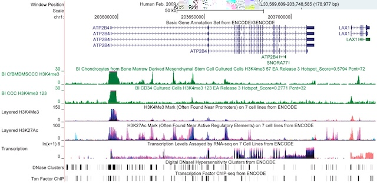

# Tutorial 5: Derive a convenience schema from a formal hierarchical metadata definition

!!! quote
	Everything simple is false. Everything which is complex is unusable. - [Paul Valéry](https://en.wikipedia.org/wiki/Paul_Val%C3%A9ry "Paul Valéry")

It is rare for data to be captured in a single flat table.

You may find that a schema you need to use is presented to you as a hierarchical set of definitions. [JSON Schema](https://json-schema.org/), for example, supports development of [complex and hierarchical data structures](https://json-schema.org/understanding-json-schema/structuring) allowing parts to be reused and referenced as subschemas. [Linked data](https://en.wikipedia.org/wiki/Linked_data) permits standardised ontologies of terms to be explicitly and unambiguously referenced, which includes the use of controlled vocabularies.

An individual experiment may consist of multiple tasks, each with multiple measurements captured in cross-referenced tables. A research project may consist of many experiments across geographically dispersed locations, and repeated over time.

And people are people. We don't all see information in the same way and will structure it in any number of ways. Different organisations - completely reasonably - may capture data in different structures from the schemas used for research data interoperability.

As the data we capture become more complex, and where the benefits of interoperability amongst diverse data become ever more important, such distribution of the complexity of managing conversion between schemas and metadata are inevitable.

How do you reconcile hierarchical source data with hierarchical destination schemas where individual tables may not map in any organic way?

!!! abstract "Learning outcomes"
	- Assess research workflows and systems to decide on appropriate strategies for mapping from complex source data to a defined hierarchical destination schema,
	- Develop techniques for defining minimal metadata to support genome annotations as FAIR objects,
	- Derive a `convenience schema` from the hierarchical [FAIRtracks model](https://github.com/fairtracks/fairtracks_standard#overview-of-structure-of-the-fairtracks-standard) and use this as a model for adapting to other formally-defined schemas,
	- Develop interoperable executable mappings from a bioinformatics case-study to the convenience schema.
	
	``` python
	SCHEMA_DESTINATION_PATH = "https://github.com/whythawk/whyqd/raw/master/tests/data/tutorial-5-fairtracks-convenience-schema.SCHEMA"
	DATASOURCE_PATH = "https://github.com/whythawk/whyqd/raw/master/tests/data/tutorial-5-metadata-49-diatom-protein-coding-gene-annotations.xlsx"
	MIMETYPE = "xlsx"
	```

## Background to case study

Data scientists often support specialists in other research domains where they have no prior knowledge. This case study presents an opportunity to identify and isolate the objectives for data interoperability even when immersed in a field - here genomics - where you may have no context.

Advances in genetic sequencing technologies and assembly algorithms have enabled an explosion in diverse reference genomes across the tree of life, together with a need to annotate functional and structural features. There is no current set of minimal metadata to support genome annotations as "FAIR objects", limiting their reproducibility and reliability.

FAIR data are data which follow the [FAIR principles](https://en.wikipedia.org/wiki/FAIR_data), a set of guidelines to improve [Findability](https://en.wikipedia.org/wiki/Findability "Findability"), Accessibility, [Interoperability](https://en.wikipedia.org/wiki/Interoperability "Interoperability"), and [Reusability](https://en.wikipedia.org/wiki/Reusability "Reusability") of scientific data.

!!! note "Case Study"
	[Annotation of protein-coding genes in 49 diatom genomes from the Bacillariophyta clade](https://docs.google.com/spreadsheets/d/1_1wKibSXbi8MQCTqpK03ytuQH71yn28xKuRS1i-mVSw/edit?gid=643002219#gid=643002219)
	Abstract of [pre-print manuscript](https://doi.org/10.48550/arXiv.2410.05467): Diatoms, a major group of microalgae, play a critical role in global carbon cycling and primary production. Despite their ecological significance, comprehensive genomic resources for diatoms are limited. To address this, we have annotated previously unannotated genome assemblies of 49 diatom species. Genome assemblies were obtained from NCBI Datasets and processed for repeat elements using RepeatModeler2 and RepeatMasker. For gene prediction, BRAKER2 was employed in the absence of transcriptomic data, while BRAKER3 was utilised when transcriptome short read data were available from the Sequence Read Archive. The quality of genome assemblies and predicted protein sets was evaluated using BUSCO, ensuring high-quality genomic resources. Functional annotation was performed using EnTAP, providing insights into the biological roles of the predicted proteins. Our study enhances the genomic toolkit available for diatoms, facilitating future research in diatom biology, ecology, and evolution.

The [FAIRification of Genomic Annotations Working Group (FGA-WG)](https://www.rd-alliance.org/groups/fairification-genomic-annotations-wg/) in the Research Data Alliance (RDA) will develop a harmonised metadata model and recommended infrastructure to improve discovery and reuse of publicly available genomic annotations/tracks, supporting harmonised metadata for [GFF3 files](https://en.wikipedia.org/wiki/General_feature_format). Such metadata exists in e.g. project-specific databases or spreadsheets, workflow systems, repositories, exchange formats, and linked data.

Harmonising metadata according to a unified data model requires the extraction, transformation and integration of data sourced in different research contexts, including messy data, using schema mappings or *crosswalks*. These operations are time-consuming and may introduce opaque errors. FAIR principles emphasise reproducibility and trust in data analyses with persisted and shared accessible, auditable and executable data transformation and validation methods.

[Omnipy](https://omnipy.readthedocs.io/) and [whyqd (/wɪkɪd/)](https://whyqd.readthedocs.io/) are independently-developed Python libraries offering general functionality for auditable and executable metadata mappings. Each is pragmatically designed to ensure transformations are executable on real-world data, with validation and feedback. They differ in scope and users, and provide complementary functionalities.

This tutorial offers a guide through the process of assessing research resources to develop an appropriate strategy for mapping to the [FAIRtracks model](https://github.com/fairtracks/fairtracks_standard#overview-of-structure-of-the-fairtracks-standard)

While a specific use-case is demonstrated here, the objective is to gain a more general understanding of ensuring data interoperability, irrespective of the schema definitions or software chosen for implementation.

The case-study is extremely domain-specific but simply illustrates the degree of complexity involved in any research project and how ensuring interoperability always leads to trade-offs between source fidelity, and data reuse and discovery.

## Minimal metadata for discovery and interoperability

!!! quote
	*The map is not the territory* - [Alfred Korzybski](https://en.wikipedia.org/wiki/Alfred_Korzybski)

Just as research is a product of what was measured, how those measurements were produced, and how data derived from these measurements were interpreted, any conversion of research outputs into different formats is an act of interpretation.

Some degree of information loss is inevitable when diverse data are remapped into an alternative schema. The trade-off between what is lost has to be balanced by the intention of what is gained through interoperability. After all, as long as the original source is maintained, any loss of fidelity should be recoverable.

A [reference genome](https://en.wikipedia.org/wiki/Reference_genome) - the assembled sequence of (typically) DNA in one idealised example of a species - may be abstracted as a line-based coordinate system. The terms `genome annotation` or `genomic track`, as described by [UCSC Genome Browser](https://genome.ucsc.edu/goldenPath/help/hgTracksHelp.html#What), are used to refer to a series of data units positioned on such a line and referring to "known- or predicted genes, ESTs, mRNAs, CpG islands, assembly gaps and coverage, chromosomal bands, mouse homologies," and so on (Figure 1).



_Figure 1: Example of genome annotations/tracks visualised in the [UCSC Genome Browser](https://genome.ucsc.edu/).
From [Rosenbloom et. al. (2011)](https://doi.org/10.1093/nar/gkr1012). Nucleic acids research. 40. D912-7. License: [CC BY-NC 3.0](https://creativecommons.org/licenses/by-nc/3.0/)_

Knowledge of this isn't necessary to understand the case-study or schema in this tutorial, but it should be clear that describing such annotations - and cross-referencing them from a research project, with its specific research methodology, to online repositories of known genomes - is inherently complex. Given the geographic and research domain distribution of investigations, ensuring that research can be found and reused is as important as maintaining the original source data.

If you do want to learn more, this [F1000 research blog post about FAIRtracks](https://blog.f1000.com/2021/12/07/fairtracks/) and the [case statement of the FGA-WG initiative](https://www.rd-alliance.org/groups/fairification-genomic-annotations-wg/work-statement/?sow=169894) offers some insight. However, the domain of overlap between different research made available in a universal explorable repository is always going to be a subset.

The draft [FAIRtracks Standard](https://github.com/fairtracks/fairtracks_standard/tree/master) consists of a hierarchical series of individual schemas which cross-reference each other, and include defined ontologies with reference terms, intended as a minimal standard for genomic track metadata.

- The main [FAIRtracks JSON Schema](https://github.com/fairtracks/fairtracks_standard/blob/master/docs/fairtracks.md),
- This top-level schema contains four arrays of JSON sub-documents for the four main object types in FAIRtracks: [`studies`](https://github.com/fairtracks/fairtracks_standard/blob/master/docs/fairtracks_study.md), [`experiments`](https://github.com/fairtracks/fairtracks_standard/blob/master/docs/fairtracks_experiment.md), [`samples`](https://github.com/fairtracks/fairtracks_standard/blob/master/docs/fairtracks_sample.md), and [`tracks`](https://github.com/fairtracks/fairtracks_standard/blob/master/docs/fairtracks_track.md).

FAIRtracks uses [EDAM](https://bioportal.bioontology.org/ontologies/EDAM), a domain ontology of data analysis and data management in bio- and other sciences. It comprises concepts related to analysis, modelling, optimisation, and the research data life cycle. Targeting usability by diverse users, the structure of EDAM is relatively simple, divided into four main sections: Topic, Operation, Data (incl. Identifier), and Format.

This model offers a flexible approach for describing the genomic annotations in a project, albeit one with a stiff learning curve.

Any conversion from a source schema to FAIRtracks will involve tradeoffs and development of a crosswalk, or interoperable mapping, between them.

## Strategies for developing interoperable mappings

Not all research projects have the same scale, and any workflow to produce interoperable *FAIRified* metadata that describes a project must be calibrated to what is appropriate.

For the purposes of this tutorial and case-study, the diversity of research capacity and workflows will be reduced to two broad alignments:

- **Bigs** are teams with a diversity of skills and resources, and an intention to automate conversion of their output data between schema definitions and submission objectives,
- **Smalls** are teams with focused or less diverse skills or resources, and an acceptance for manual (or semi-manual) conversion of their output data for alternative uses.

The path from project data and resources to interoperable / publication-ready metadata comes down to that team's capacity to develop and execute conversion processes.

A big research project with predefined metadata structure reduced to a relational database, with a dedicated data scientist or software engineer to produce automated scripts for export is very different from a small research team working off ad-hoc spreadsheets and documents.

These constraints imply two different paths towards implementing an interoperable mapping (Figure 2):

- **Direct**, using some general scripting language or a more specialised tool like Omnipy,
- **Convenience**, where simpler scripts or manual operations are performed to convert source to a simplified interim schema with an already-coded set of executable scripts to convert to the final model.


_Figure 2: Research workflows for varying project complexity_

This tutorial is a guide to the approach a **small** team may take using semi-structured data to produce FAIRtracks-conformant metadata. Instead of developing software to go direct from source to a formal hierarchical schema, a more calibrated approach is to work towards a `convenience schema` which has much the same metadata definitions as the full destination schema, but without the same validation enforcement, and with a simplified structure.

This incremental approach permits data to be transformed and validated via more manageable steps.

## Deriving a convenience schema from a hierarchical model

A **convenience** process works towards producing a single, flattened tabular version of a hierarchical schema, with *visual* or *tacit* validation, rather than strict enforcement of schema requirements.

This could be as simple as downloading a CSV template with header columns and copying/pasting source data across, or using whyqd to manage the process. The flattened schema should include all information from the hierarchical schema, and should also be permissive so that incomplete / partial data from multiple spreadsheets can be progressively merged without issues of validation or completeness blocking individual steps.

Once in this format, an automated executable crosswalk can validate and convert the data into the formal hierarchy as defined.

The objectives of a *flattened* version of this hierarchy:

- Ideally one - and **only** one - convenience schema definition,
- Accessible as a single CSV with a header-row containing terms from across the original hierarchical version,
- Accessible as a JSON-Schema form for use in whyqd or alternative software,
- With definitions for each term adjusted to reflect a more permissive approach to data validation *in this step* - validation will still happen before conversion to the standard model,
- A standard script which maps the convenience schema to its final form.

These flattened forms will be available as:

- CSV with header-row
- whyqd schema

There are always going to be compromises and one obvious way where this shows up is with sub-tables. Say we had a top-level table like this:

| Reference | Topic       |
| --------- | ----------- |
| 0001      | New topic A |
| 0002      | New topic B |

Which references sub-level terms like this:

| Reference | Measurement A | Measurement B |
| --------- |---------------|---------------|
| 0001      | 20            | 2.4           |
| 0002      | 24            | 1.8           |

Also, say we need to flatten these data into a convenience table where different types of measurements must be merged. This would necessitate lists as values in the new table:

| Reference | Topic       | Measurement types | Measurements |
| --------- | ----------- |-------------------|--------------|
| 0001      | New topic A | [A, B]            | [20, 2.4]    |
| 0002      | New topic B | [A, B]            | [24, 2.8]    |

The order of the two sets of lists must correspond to ensure appropriate labelling of the measurements. And, obviously, it can get more complex than this. However, we have two types of column here:

- *Extracted values* in `Measurements` are extracted directly from the source data. You can write a crosswalk for this using **whyqd's** `COLLATE` action.
- *Constant terms* in `Measurement types` are a constant derived from the column headers (here, but the definitions in the convenience schema may call for completely different terms). You can add these using the `NEW` action ... however, is this appropriate?

**whyqd's** primary purpose is auditable source data extraction into a destination schema. Missing data - whether constants or derived algorithmically from these source data - are beyond the scope and objective of a whyqd crosswalk.

`NEW` exists primarily to add a cross-reference value to a new table for assembling multiple source tables afterwards. Certainly, it can be used to add additional data, but using whyqd to do this may add additional complexity without improving audit quality.

Whether you choose to add it via a post-crosswalk script, or in the script itself makes no real difference as it is not derived from the source.

The implications for designing the convenience schema is that it should give flexibility to the user. All fields should be optional so that they can be iteratively built up from diverse source data which may be scattered across multiple source tables, or added in as constants or calculated values later on.

This supports the iterative workflow of transforming into a convenience schema.

## Scripting mappings as executable crosswalks

The source data for this tutorial are available as follows:

``` python
SCHEMA_DESTINATION_PATH = "https://github.com/whythawk/whyqd/raw/master/tests/data/tutorial-5-fairtracks-convenience-schema.SCHEMA"
DATASOURCE_PATH = "https://github.com/whythawk/whyqd/raw/master/tests/data/tutorial-5-metadata-49-diatom-protein-coding-gene-annotations.xlsx"
MIMETYPE = "xlsx"
```

We start with importing the libraries we need, and defining our global variables:

``` Python
import whyqd as qd
import numpy as np
import modin.pandas as pd
from itertools import chain

SCHEMA_SOURCE = {}
DATA_SOURCE = {}
```

We now import our source data (which includes multiple sheets in the single Excel file), and structure it so that we can access it progressively as we work through our crosswalks:

``` Python
# Get the destination schema
SCHEMA_DESTINATION = qd.SchemaDefinition(source=SCHEMA_DESTINATION_PATH)
# Get data sources from multiple sheets and derive the source schemas for each
datasource = qd.DataSourceDefinition()
datasource.derive_model(source=DATASOURCE_PATH, mimetype=MIMETYPE)
for ds in datasource.get:
    # We separate out the individual sheets to transform independently
    DATA_SOURCE[ds.sheet_name.lower()] = ds
    schema_source = qd.SchemaDefinition(source={
          "name": ds.sheet_name.lower()
    })
    schema_source.derive_model(data=ds)
    SCHEMA_SOURCE[ds.sheet_name.lower()] = schema_source
```

We can list the `SCHEMA_SOURCE` to orientate ourselves, and you can easily open the spreadsheet as well:

``` Python
{'input_data_accession_numbers': Schema: `input_data_accession_numbers`,
 'entap_functional_annotation_sum': Schema: `entap_functional_annotation_sum`,
 'software_and_container_versions': Schema: `software_and_container_versions`,
 'annotations_descriptive_statist': Schema: `annotations_descriptive_statist`,
 'repeats': Schema: `repeats`,
 'busco_scores': Schema: `busco_scores`,
 'omark_scores': Schema: `omark_scores`,
 'busco_version_dependencies': Schema: `busco_version_dependencies`}
```

We can now prepare our crosswalks for each source schema. The joining field across the useable sheets are some variation of `Species name`. However, while useable data are scattered throughout the sheets, only a subset are addressable via a `whyqd` crosswalk while the rest would need to be added in as a `NEW` action, or through some customisation later depending on your strategy.

!!! tip "Strategy"
	`NEW` actions are best for supporting cross-referencing between related tables, rather than ubiquitously adding missing constants. **whyqd** is a curation and audit transparency tool between *source* and *destination*, rather than a means for adding or manipulating data to create new or derived fields.

After evaluation, the useable schemas and source data sheets we will use for this case study are as follows:

- `input_data_accession_numbers`
- `entap_functional_annotation_sum`
- `busco_scores`
- `omark_scores`

Let's describe the crosswalks in these terms:

```Python
CROSSWALK_SCRIPTS = {
    "input_data_accession_numbers": [
        "SELECT > 'local_id' < ['Species name']",
        "SELECT > 'track_assembly_id' < ['Genome assembly accession number']",
        "NEW > 'track_feature' < ['http://purl.obolibrary.org/obo/SO_0000704']",
        "COLLATE > 'experiment_evidence_global_id' < ['RNAseq Libraries used for annotation','Legacy genome assembly accession number or protein source (protein sequence source used for annotation)','OrthoDB Proteins']",
        "COLLATE > 'experiment_annotation_method_name' < ['Annotation method']",
        "COLLATE > 'study_publication' < ['Data Zenodo DOI','Publication with Methods Descripton']",
        "SELECT > 'track_file_url' < ['Data File on Zenodo']",
        "SELECT > 'track_file_name' < ['Data File on Zenodo']",
        "NEW > 'study_study_name' < ['Annotation of protein-coding genes in 49 diatom genomes from the Bacillariophyta clade']",
        "NEW > 'study_contact_name' < ['Katharina Hoff']",
        "NEW > 'study_contact_email' < ['katharina.hoff@uni-greifswald.de']",
        "NEW > 'study_contact_orcid' < ['orcid:0000-0002-7333-8390']",
        "NEW > 'experiment_technique' < ['http://edamontology.org/operation_0362']",
        "NEW > 'track_file_format' < ['http://edamontology.org/format_1975']",
    ],
    "entap_functional_annotation_sum": [
        "SELECT > 'local_id' < ['Species']",
        "NEW > 'experiment_compute_protocol_description' < ['https://docs.google.com/spreadsheets/d/1_1wKibSXbi8MQCTqpK03ytuQH71yn28xKuRS1i-mVSw/edit?gid=52185137#gid=52185137']",
    ],
    "busco_scores": [
        "SELECT > 'local_id' < ['Species name']",
        "COLLATE > 'track_evaluation_method_value' < ['BUSCO scores genome level','BUSCO scores protein level']",
    ],
    "omark_scores": [
        "SELECT > 'local_id' < ['Species name']",
        "COLLATE > 'track_evaluation_method_value' < ['OMArk sum']",
    ],
}
```

The first of each crosswalk identifies the reference field. We have added a number of new static terms (e.g. `'Katharina Hoff'` in the `study_contact_name` destination field), but this did not need to be added here.

Let's now run these crosswalks:

``` Python
TRANSFORM_DATA = []

for key, cw_script in CROSSWALK_SCRIPTS.items():
    # Define a Crosswalk
    crosswalk = qd.CrosswalkDefinition()
    crosswalk.set(schema_source=SCHEMA_SOURCE[key], schema_destination=SCHEMA_DESTINATION)
    crosswalk.actions.add_multi(terms=cw_script)
    # Transform a data source
    transform = qd.TransformDefinition(crosswalk=crosswalk, data_source=DATA_SOURCE[key])
    transform.process()
    TRANSFORM_DATA.append(transform.data)
```

This leaves us with four transformed data files which need to be merged into our single convenience schema. As we do this, we need to deal with special cases.

`track_evaluation_method_value` is found in the `busco_scores` and `omark_scores` transforms. The field is required to be an array (hence the `COLLATE` action). Merging these, and assigning it's corresponding `name` field which uniquely identifies each value in the arrays, requires the following approach:

- Restructure the `omark_scores` field, since this has only a single value, but is structured as `[[x1], [x2], [x3], ...]`.
- Concatenate it with the `busco_scores` column and update the original column.
- Assign a new `track_evaluation_method_name` with the static value `['BUSCO scores genome level','BUSCO scores protein level', 'OMArk sum']`.

Merging and dealing with these requirements is coded as such:

``` Python
# 1. Merge `input_data_accession_numbers` and `entap_functional_annotation_sum`
df = pd.merge(TRANSFORM_DATA[0], TRANSFORM_DATA[1], how="outer", on="local_id")

# 2. Process `busco_scores` and `omark_scores`, then merge
# First get the column values as arrays
busco_values = TRANSFORM_DATA[2]["track_evaluation_method_value"].to_numpy()
omark_values = TRANSFORM_DATA[3]["track_evaluation_method_value"].to_numpy()
# Unpack and get the T value of the `omark` values
omark_values = np.array([list(chain(*omark_values.tolist()))])
# Concatenate into a new list and assign
TRANSFORM_DATA[2]["track_evaluation_method_value"] = np.concatenate((busco_values.tolist(), omark_values.T), axis=1).tolist()
df = pd.merge(df, TRANSFORM_DATA[2], how="outer", on="local_id")

# 3. Add in missing `name` array fields, as required
# `experiment_evidence_global_id` requires a corresponding `experiment_evidence_evidence_type` with value `['RNA', 'proteins', 'protein database']`
df["experiment_evidence_evidence_type"] = np.tile(["RNA", "proteins", "protein database"], (len(df), 1)).tolist()
# `track_evaluation_method_value` requires a corresponding `track_evaluation_method_name` with value `['BUSCO scores genome level','BUSCO scores protein level', 'OMArk sum']`
df["track_evaluation_method_name"] = np.tile(["BUSCO scores genome level","BUSCO scores protein level", "OMArk sum"], (len(df), 1)).tolist()
```

If there are any other constant fields you wish to add, you can do so now, and then the data file can be saved.

## Expanding from `convenience` to a formal schema

The convenience schema is a formally defined data structure. The formal FAIRtracks model is, likewise, defined. While complex - and beyond the scope of this tutorial - a standardised mapping script can be written which converts (or expands) the convenience method to its final form.

Not only does such a script only need to be written once, it only needs to be written once *at all*. Meaning that the FAIRtracks team will do this once the schemas are finalised and you would be able to run this automatically.

!!! tip "Strategy"
	The `convenience` schema did not fully validate all the terms and values. The next step, going into the formal schema, will run these checks and will raise exceptions if there are any problems. That means converting to the convenience schema supports the transformation process, but is not the final step just yet.

The process of going from *schemas in use* to *schemas for interoperability* is slow and needs to be done carefully and methodically. 

If such work is to be performed regularly, and you have the resources, then it makes sense to formalise your source data schema and script the validation and conversion process in advance. That way the transformation happens automatically, and is invisible to your daily work.

If not, then the approach detailed here is likely to be the most useful to you.
